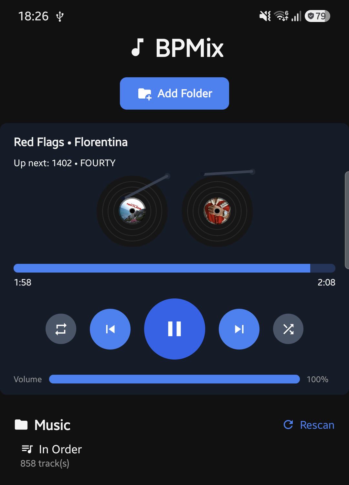
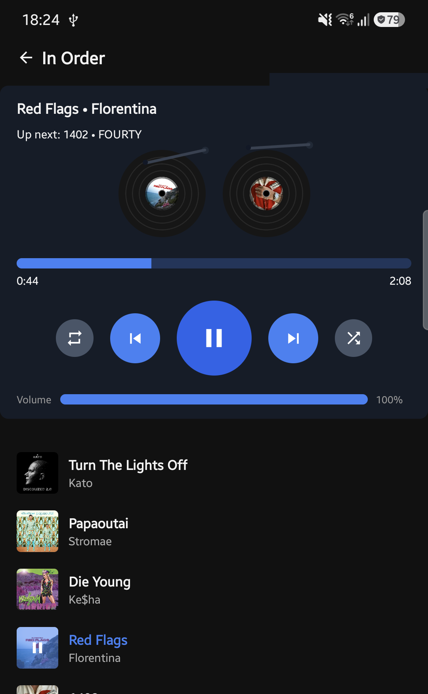

# BPMix

A cross-platform DJ-style music player that crossfades between tracks
instead of just switching to the next one — Android, web, and a
self-hostable server, all sharing one playback engine.

<p align="center">
  
  
</p>

## What it does

- **Crossfades between tracks** on an equal-power gain curve (not a linear
  fade), so the current track's normalized volume ramps down while the
  next one ramps up, timed to a configurable crossfade length.
- **Renders the current and next track as spinning vinyl records**
  (`CrossfadeArt`), with a tonearm needle that tracks real playback
  progress, and spin speed/rotation tied to how audible each track
  actually is right now.
- **Reads real ID3 metadata** (title, artist(s), album, cover art) from
  audio files, scanned asynchronously in the background so the library
  is usable immediately and fills in as tags are read.
- **Shuffle, loop, and playlist persistence** — `.m3u8` playlists, folder
  scanning, and gapless-ish playback via a shared `PlaylistPlayer`.
- **Runs the same UI on Android and web** via React Native + React Native
  Web, sharing components/business logic in `packages/ui`/`packages/core`
  rather than duplicating it per platform.
- **Self-hostable**: `apps/server` serves the built web app plus a music
  library mounted into a Docker container, so any browser (not just
  Chromium, which is all the browser-only build supports via the File
  System Access API) can browse and play a library that lives elsewhere
  entirely (a NAS, a home server, ...).

## Project layout

This is a pnpm workspace monorepo:

| Path | What it is |
| --- | --- |
| `apps/mobile` | The React Native app (Android; Windows support in progress). |
| `apps/web` | The same UI running on the web via `react-native-web` + Vite. |
| `apps/server` | Optional self-hosting backend — serves `apps/web`'s build and exposes a Docker-mounted library over HTTP. See `apps/server/README.md`. |
| `packages/core` | Platform-agnostic playback/analysis/library logic: `PlaylistPlayer`/`TrackPlayer`, BPM/loudness/silence analysis, the crossfade gain curve, library scanning, metadata. No React, no platform APIs. |
| `packages/ui` | Shared React Native components used by both apps (`CrossfadeArt`, `TrackList`, `SeekBar`, icons, etc.), including platform-split files (e.g. `useSpin.ts` vs `useSpin.web.ts`) where mobile and web genuinely need different implementations. |

## Getting started

Requires Node 20+ and pnpm.

```sh
pnpm install

# Android (needs Metro + a device/emulator, same as any RN app)
pnpm android

# Web
pnpm web

# Type-check and test everything
pnpm typecheck
pnpm test
```

Self-hosting via Docker is documented separately in
[`apps/server/README.md`](apps/server/README.md).

## Status

BPMix is under active development — see `CLAUDE.md`'s TODOs section for
what's planned (a just-in-time BPM-matching crossfade engine, playback
state persistence, synced lyrics, and more). The crossfade/vinyl-art
pieces shown above are functional; some of the more ambitious
beatmatching work is still in progress.

## License

MIT — see [`LICENSE`](LICENSE).
